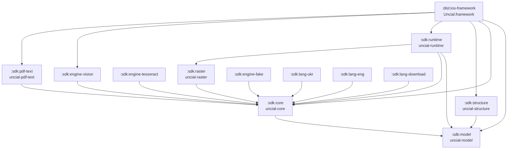

# Architecture Overview

Uncial is a set of small Gradle modules with one entry point (`uncial-runtime`) and a
deliberately thin contract layer (`uncial-core`) that everything else plugs into. The shape
of the graph is not incidental — two rules hold it together, and both exist to keep the
runtime independent of any particular OCR engine.

## Module graph



Every edge above is a real declaration in a module's `build.gradle.kts`. Note what is
**absent**: `runtime` has no edge to any engine, and none to `structure`.

| Module | Targets | Third-party dependencies |
|---|---|---|
| `model` | android, jvm, ios | none — Kotlin stdlib only |
| `core` | android, jvm, ios | `kotlinx-coroutines-core`; on Android `androidx.startup` (`api`) + `androidx.annotation` |
| `structure` | android, jvm, ios | none; 100% `commonMain` |
| `raster` | android, jvm, ios | PDFBox on the JVM only (`PdfRenderer` and PDFKit are framework) |
| `runtime` | android, jvm, ios | none beyond `core` |
| `pdf-text` | android, jvm, ios | PDFBox (JVM), PDFBox-Android (Android) |
| `engine-tesseract` | android, jvm | Tesseract4Android (Android), Tess4J + JNA (JVM) |
| `engine-vision` | ios | none — Vision and PDFKit are system frameworks |
| `engine-fake` | android, jvm, ios | none |
| `lang-ukr` / `lang-eng` | android, jvm | none — the payload is a `.traineddata` asset/resource |
| `lang-download` | android, jvm | none — `HttpURLConnection`, shared via a `jvmAndAndroid` source set |
| `dist:ios-framework` | ios | the umbrella; re-exports the six modules above |

`model` appears in the signature of every other module, so it is kept small enough that
nobody wants to change it: no coroutines, no serialization, no IO.

## Separation 1 — rasterization is not recognition

The proof-of-concept this SDK grew out of had a single `ocr(bytes)` call per platform.
`core` splits that into two roles that meet at `Raster`:

```
PageRasterizer.open(bytes) → RasterizedDocument.rasterize(page, options) → Raster
                                                                            ↓
                                        TextRecognizer.recognize(raster, pageIndex, options) → OcrPage
```

| | Android | iOS | JVM |
|---|---|---|---|
| `PageRasterizer` | `PdfRenderer` | PDFKit | PDFBox |
| `TextRecognizer` | Tesseract4Android | Vision | libtesseract via JNA |

Three things fall out of the split, and none of them needed extra design:

- **Image input.** A caller who already has pixels — a camera frame, a gallery pick, a
  screenshot — constructs a `Raster` and calls `extract(raster)`. No PDF is involved.
- **Testable recognition.** An engine can be exercised against a PNG with none of the PDF
  machinery present, which is what the iOS integration tests do.
- **Engine swapping.** Either half can be replaced without touching the other:
  `UncialClientBuilder.rasterizer` and `.engine` are independent knobs.

`PageRasterizer.open` is separate from `RasterizedDocument.rasterize` on purpose: the page
count is known
before any pixels are allocated, which is what makes a meaningful `Flow<OcrProgress>`
possible.

### Raster lifetime

A 200 dpi A4 raster is several megabytes, and a 300-page document rasterized eagerly is not
survivable on a phone. `ExtractionPipeline` therefore rasterizes one page at a time and
calls `Raster.release()` in a `finally` immediately after recognition — not at the end of
the document. A raster the *caller* constructs is the caller's to release.

## Separation 2 — the runtime never names an engine

```kotlin
// sdk/runtime/build.gradle.kts
commonMain.dependencies {
    api(projects.sdk.model)
    api(projects.sdk.core)
    implementation(projects.sdk.raster)
}
```

That list is the module's most important property. There is **no** dependency on
`engine-tesseract` or `engine-vision`, so the runtime cannot be made to depend on either by
accident. It reaches an engine only through `OcrEngineFactory`, resolved at first use via
`OcrEngineRegistry` — see [Engine registry](engine-registry.md).

What that buys:

- An Android consumer who only OCRs photographs does not drag in PDFBox-Android; an iOS
  consumer never sees Tesseract at all.
- A third-party engine is a first-class citizen: implement `OcrEngineFactory`, register it
  (or pass it to the builder), and nothing in the SDK needs to change.
- Tests inject `FakeOcrEngine` through the same door the real engines use.

!!! warning "Never add an engine to `runtime`'s dependencies"
    The one place the rule stops applying is `:dist:ios-framework`, and only because a
    distribution artifact is exactly where the runtime and an engine are allowed to meet:
    iOS consumers get one binary, not a set of Gradle modules.

The same indirection covers the digital text layer. `DigitalTextExtractor` is declared in
`core`, so the runtime can take the PDF text-layer fast path without depending on
`pdf-text`, which implements it. Absent that module the runtime simply has no extractor and
goes straight to OCR — and `OcrOptions.preferDigitalLayer` is inert rather than broken.

## What the runtime actually does

`UncialClient` is the whole public entry point. `ExtractionPipeline` behind it:

1. If a `DigitalTextExtractor` is wired up and `preferDigitalLayer` is set, read the PDF's
   text layer. If every requested page came back with lines, emit the document with
   `ExtractionSource.DigitalTextLayer` — roughly a thousand times faster than OCR, and
   exact.
2. Otherwise open the PDF with the `PageRasterizer`, reuse any page the text layer already
   covered, and rasterize + recognize the rest. Mixed results report
   `ExtractionSource.Mixed`.
3. Emit `OcrProgress` per page and check cancellation at every page boundary.

`structure` is not part of this path at all. It is a pure function over the result —
`DocumentStructure.reconstruct(document): List<DocBlock>` — with its thresholds in
`StructureOptions`, and a caller who only wants raw text may never invoke it. That is why
`runtime` does not depend on it: a consumer who wants headings and paragraphs adds
`uncial-structure` and calls it themselves.

## One coordinate model

Everything Uncial returns uses **top-down pixels, origin at the page's top-left**.

The sources do not agree natively: Vision reports bottom-up normalized coordinates, and PDF
is bottom-up in points. Each engine converts at its own edge, so no caller ever has to.
`pdf-text` additionally scales points by `OcrOptions.renderScale`, which makes a digital
page and an OCR'd page of the same document directly comparable.

Two rules that fall out of the PDF side: the **crop box** is the frame of reference, never
the media box (`LegacyPDFStreamEngine` expresses every `TextPosition` relative to it, and
all three rasterizers render it), and `/Rotate 90|270` swaps both the rendered sides and the
reported page size.

## Conventions that apply to every module

- **`explicitApi()` strict plus a committed ABI dump.** Kotlin's built-in `abiValidation`
  replaces the standalone binary-compatibility-validator; `checkKotlinAbi` runs as part of
  `build`, so an API change fails the build until `updateKotlinAbi` is run and the diff
  reviewed. The `api/*.api` files are the authoritative public surface.
- **Convention plugins in `build-logic/convention/`** — `uncial.kmp.base`,
  `uncial.target.{android,jvm,ios}`, `uncial.language-data`, `uncial.publish`. Modules
  declare intent, not build configuration. The target set is exactly android + jvm +
  iosArm64 + iosSimulatorArm64 + iosX64. They are plugin classes extending
  `BaseConventionPlugin`, which fixes the order in which a module is configured.
- **`core/` is what is `internal`, `source/` is the surface**, each nested one level deep in
  a semantic folder, with no `.kt` file loose at a package root. It holds in every module —
  the SDK, `:dist:ios-framework`, both samples and the convention plugins. `core/` exists
  only where a module really has internal declarations, so `model`, `raster` and
  `engine-fake` have none.
- **One file, one artifact.** Every top-level `class`/`object`/`fun`/`val` that is `public`
  or `internal` lives in its own file, named after it — `debug` in `Debug.kt`. The exception
  is a `private` helper serving exactly one artifact, which stays in that artifact's file
  rather than widening the surface. Note that on the JVM a file name is part of the binary
  API: splitting a file renames the synthetic `<FileName>Kt` class Java callers see.
- **Every module carries its own `README.md` and `CLAUDE.md`** next to the code — what the
  module is and what not to break when editing it. These pages are the published view; those
  two are the working one.
- **Archive names are rewritten** from `:sdk:model` to `uncial-model`, so Gradle paths stay
  readable while the published coordinates match the artifact names.
- **A module's `consumer-rules/*.pro` is packaged into its AAR automatically** by
  `uncial.target.android` — the consumer copies nothing.
- **No DI framework.** The composition root is `UncialClientBuilder`, hand-written. A DI
  container inside a library is a dependency forced on the consumer and a version-conflict
  source.
- **`kotlin.runCatching` is banned in the extraction path** — it swallows
  `CancellationException`. Use `runCatchingOcr` in `runtime`, or `orElseOnFailure` /
  `runReportingFailure` in `engine-tesseract`, which must not depend on `runtime`.
